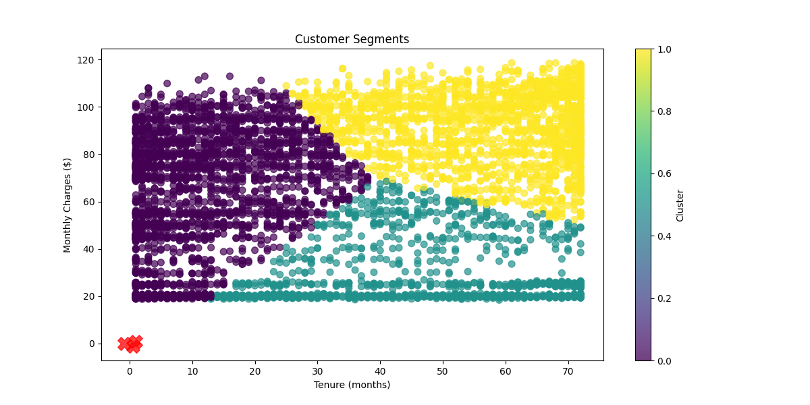

# Telco Churn Predictor: Interactive Dashboard & Analysis

## Overview
This project provides an interactive dashboard for analyzing and predicting customer churn in the telecommunications industry. Using machine learning models trained on the Telco Customer Churn dataset, this application helps identify customers at high risk of churning and the key factors influencing their decisions.

The dashboard visualizes customer segments, churn patterns, and model performance metrics, making complex data insights accessible and actionable for business stakeholders.

## Problem Statement
In the highly competitive telecom market, customer churn (customers leaving for competitors) significantly impacts revenue. With annual churn rates of 15-25%, retaining existing customers is more cost-effective than acquiring new ones. This project develops predictive models to identify at-risk customers and understand churn drivers to help telecom companies implement effective retention strategies.

## Dataset
This project uses the "Telco Customer Churn" dataset from Kaggle:
- **Source**: [Kaggle - Telco Customer Churn](https://www.kaggle.com/datasets/blastchar/telco-customer-churn)
- **Note**: The dataset file is not included in this repository due to size limitations. Please download it from the Kaggle link above and place it in the `data/` directory with the filename `WA-Fn-UseC-Telco-Customer-Churn.csv` before running the application.

The dataset contains information about:
- Customer demographics (gender, age, partners, dependents)
- Account information (tenure, contract type, payment method, billing preferences)
- Services subscribed (phone, internet, tech support, streaming TV, etc.)
- Customer status (active or churned)

## Project Structure
```
├── app/
│   ├── dashboard_pages/
│   │   ├── __init__.py
│   │   ├── customer_insights.py
│   │   ├── model_performance.py
│   │   ├── overview.py
│   │   └── prediction_tool.py
│   ├── app.py
│   ├── dashboard.py
│   └── style.css
├── artifacts/
│   ├── customer_segments.csv
│   ├── customer_segments.png
│   ├── feature_importance.png
│   └── shap_summary.png
├── data/
│   └── WA-Fn-UseC-Telco-Customer-Churn.csv
├── models/
│   ├── business_optimization.png
│   ├── churn_model.pkl
│   ├── evaluation_metrics.json
│   ├── feature_importance.csv
│   ├── model_columns.pkl
│   ├── optimal_thresholds.pkl
│   ├── pr_curve_data.npz
│   ├── roc_data.npz
│   ├── scaler.pkl
│   └── threshold_optimization.png
├── scripts/
│   ├── explain_model.py
│   ├── model_training.py
│   ├── predict_churn.py
│   └── run.py
├── tests/
│   ├── test_api.py
│   └── test_model.py
├── utils/
│   ├── __init__.py
│   ├── churn_utils.py
│   ├── data_prep.py
│   ├── data_validation.py
│   └── feature_eng.py
├── .gitignore
├── README.md
└── requirements.txt
```

## Methodology
The project follows these key steps:

1. **Data Preparation and Validation**
   - Data cleaning and validation using utilities in `utils/`
   - Feature engineering with `utils/feature_eng.py`
   - Data preprocessing with `utils/data_prep.py`

2. **Model Development**
   - Model training using `scripts/model_training.py`
   - Algorithm selection and hyperparameter tuning
   - Model evaluation and threshold optimization
   - SHAP analysis for model interpretation with `scripts/explain_model.py`

3. **Business Optimization**
   - Customer segmentation analysis
   - ROC and PR curve analysis for optimal decision thresholds
   - Feature importance ranking
   - Business impact assessment

4. **Dashboard Development**
   - Interactive dashboard with multiple pages:
     - Overview of churn statistics
     - Customer insights and segmentation
     - Model performance metrics
     - Prediction tool for churn probability
   - Implemented with Python and CSS styling

## Key Findings
- Customers with month-to-month contracts are more likely to churn
- High monthly charges correlate with increased churn rates
- Customers with fiber optic internet service show higher churn rates
- Lack of technical support and online security services increases churn probability
- New customers (shorter tenure) are at higher risk of churning

## Getting Started

### Prerequisites
- Python 3.8+
- Required libraries listed in requirements.txt

### Installation
1. Clone the repository
```bash
git clone https://github.com/jc-111/Telco_Churn_Predictor.git
cd Telco_Churn_Predictor
```

2. Create and activate a virtual environment (optional but recommended)
```bash
python -m venv venv
source venv/bin/activate  # On Windows: venv\Scripts\activate
```

3. Install the required packages
```bash
pip install -r requirements.txt
```

4. Download the dataset
   - Visit [Kaggle - Telco Customer Churn](https://www.kaggle.com/datasets/blastchar/telco-customer-churn)
   - Download the dataset (Kaggle account required)
   - Create a `data` directory in the project root if it doesn't exist
   - Place the downloaded dataset in the `data/` directory with the filename `WA-Fn-UseC-Telco-Customer-Churn.csv`

### Running the Dashboard
The interactive dashboard is built with Streamlit and is the main interface for exploring the churn prediction model and insights:

```bash
streamlit run app/dashboard.py
```

This will launch the Streamlit application in your default web browser, where you can:
- View overall churn statistics and trends
- Explore customer insights and segments
- Analyze model performance metrics
- Use the prediction tool to calculate churn probability for specific customers

### Dashboard Features
- **Overview**: Summary statistics and key metrics about customer churn
- **Customer Insights**: Detailed visualization of customer segments and behaviors
- **Model Performance**: Evaluation metrics, ROC curves, and threshold optimization
- **Prediction Tool**: Interactive interface to input customer data and get churn predictions



## Business Applications
- Targeted retention campaigns for high-risk customers
- Service improvement based on identified pain points
- Contract and pricing strategy optimization
- Customer experience enhancement focused on key churn drivers

---

*Note: This project is for educational and analytical purposes. The insights and models should be validated in a real business context before implementation.*
